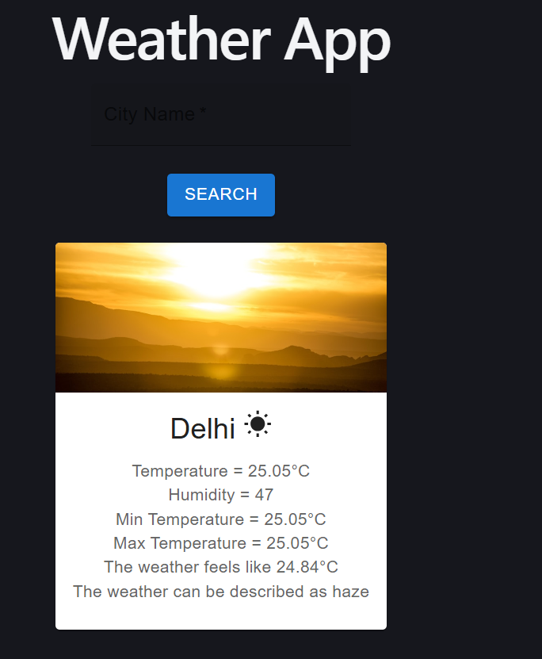
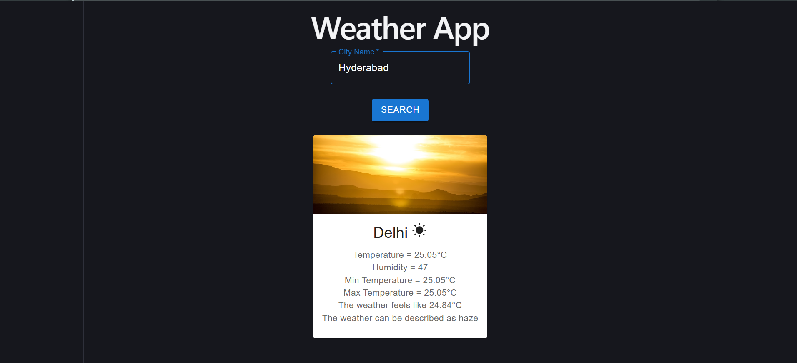
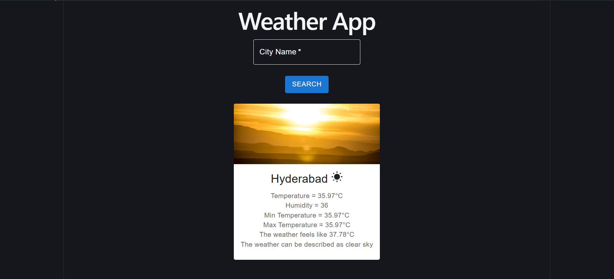

# 🌦️ Weather App

A modern and responsive weather application built with **React**, **Vite**, and **Material UI** that provides real-time weather information for cities around the world using the OpenWeatherMap API.

## 🚀 Features

- Search weather by city name
- Real-time weather updates
- Displays:
  - Current Temperature
  - Feels Like Temperature
  - Minimum Temperature
  - Maximum Temperature
  - Humidity
  - Weather Description

- Dynamic weather images based on weather conditions
- Weather icons for different temperature and weather states
- Error handling for invalid city names
- Responsive and user-friendly interface

## 🛠️ Tech Stack

- React
- Vite
- Material UI (MUI)
- OpenWeatherMap API
- CSS

## 📸 Screenshot





## 📂 Project Structure

```text
src/
├── assets/
│   ├── hero.png
│   ├── react.svg
│   └── vite.svg
├── App.jsx
├── WeatherApp.jsx
├── SearchBox.jsx
├── InfoBox.jsx
├── App.css
├── SearchBox.css
├── InfoBox.css
├── index.css
└── main.jsx
```

## ⚙️ Installation & Setup

### 1. Clone the Repository

```bash
git clone https://github.com/emokshita/weather-app-react.git
```

### 2. Navigate to the Project Directory

```bash
cd weather-app-react
```

### 3. Install Dependencies

```bash
npm install
```

### 4. Create a `.env` File

Create a `.env` file in the root directory and add:

```env
VITE_API_URL=https://api.openweathermap.org/data/2.5/weather
VITE_API_KEY=YOUR_API_KEY
```

### 5. Run the Application

```bash
npm run dev
```

Open the local URL displayed in the terminal to view the application.

## 🌐 API

This project uses the OpenWeatherMap API to fetch real-time weather data.

## ✨ Future Enhancements

- 5-Day Weather Forecast
- Current Location Weather
- Dark Mode Support
- Search History
- Air Quality Index (AQI)
- Weather Animations

## 👩‍💻 Author

**Mokshita Enukurthi**

GitHub: https://github.com/emokshita
